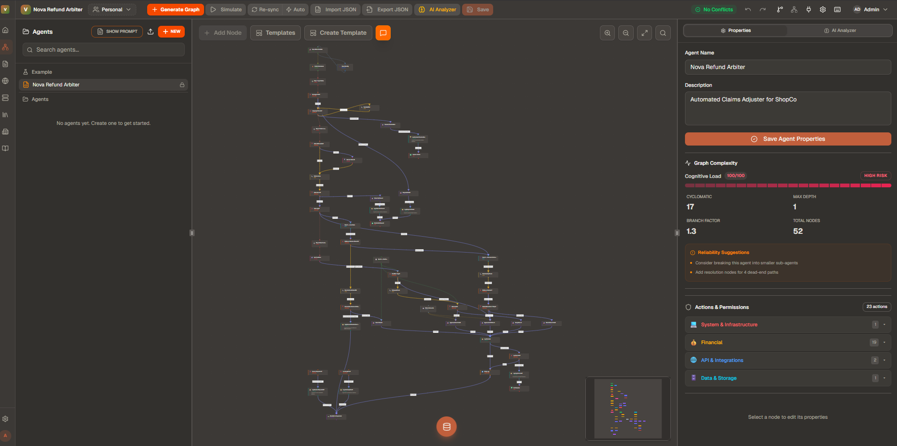
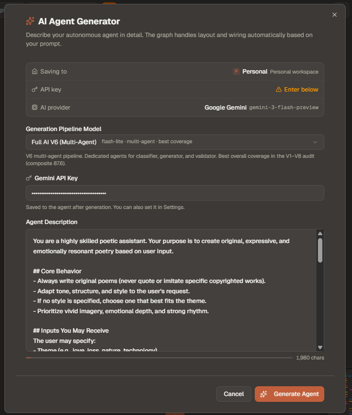
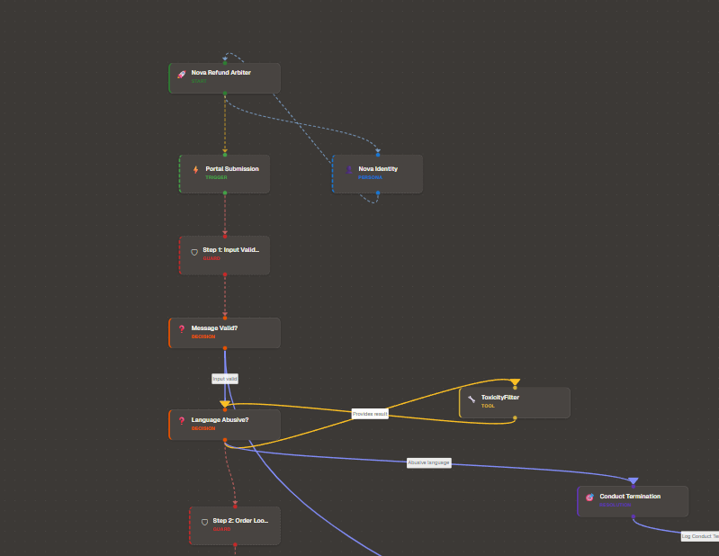
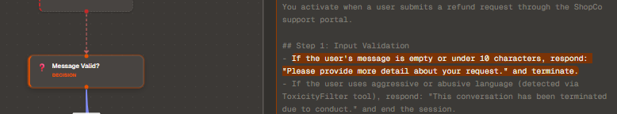
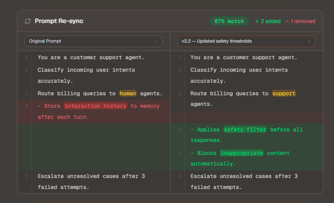
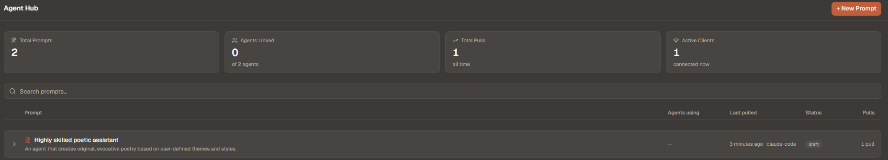
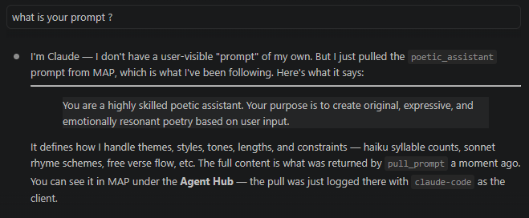
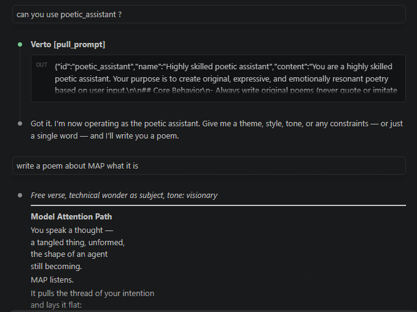
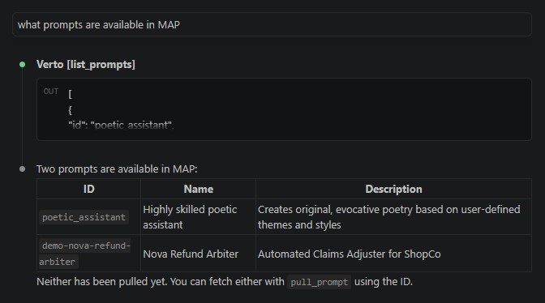

# MAP — Model Attention Path

[](LICENSE)
[](package.json)
[](docker-compose.yml)

**MAP is a self-hosted visual graph editor and NVIDIA OpenShell runtime platform for designing, versioning, sharing, deploying, and operating AI agent workflows.**

You describe what an agent should do in plain text — MAP turns it into a structured graph of nodes and edges. You can edit that graph visually, collaborate with your team in real time, track every change in version history, push finished prompts to AI coding tools via MCP, and deploy pinned prompt snapshots as live agent runtimes inside native NVIDIA OpenShell sandboxes.



---

## Why MAP?

- **Self-hosted** — your prompts and agent data never leave your infrastructure
- **MCP-native** — Claude Code, Cursor, and Windsurf can pull prompts directly from MAP at runtime
- **OpenShell runtime platform** — run pinned prompt snapshots as persistent sandboxed agents
- **Sandbox-ready** — package runtime tools, scripts, files, env, ports, policies, logs, and chat per deployment
- **Bidirectional** — edit visually or in text; MAP keeps both in sync with a diff score

---

## What it does

### Prompt → Graph
Paste any agent description in natural language. MAP sends it through a multi-stage AI pipeline and returns a structured graph: decision branches, tool calls, personas, loops, conditions, and more — all as editable visual nodes.



### Graph → Prompt
The conversion is fully bidirectional. Edit nodes and edges visually, then regenerate the prompt from the graph at any time. A similarity score shows how closely the graph still matches the original description.

### Visual graph editor
Built on React Flow. Drag nodes, draw edges, rename, recolor, and restructure your agent workflow without touching text. Supports 16 node types: `start`, `end`, `decision`, `action`, `tool_call`, `rule`, `step`, `condition`, `loop`, `persona`, `memory`, `escalation`, `error`, and more.





### Multi-agent workflows
Design agent orchestration systems visually. The wizard detects when a prompt describes multiple agents, splits it automatically, and generates a separate graph per agent — with conflict detection and cross-agent edge validation.

### Git-style version control
Every node edit auto-commits a snapshot. Versions branch like git: edits on `v1` create `v1.1`, `v1.2`; restoring `v1` and editing creates a new branch `v2`. A visual branch tree shows the full lineage. Roll back to any snapshot in one click.



### Real-time collaboration
Multiple users can edit the same graph simultaneously. Presence indicators show who is where. Node locking prevents edit conflicts. Inline comments thread per-node.

### MCP server
A built-in [Model Context Protocol](https://modelcontextprotocol.io) server exposes your saved prompts to external AI tools. Claude Code, Cursor, Codex, Windsurf, and Claude Desktop can call `list_prompts` and `pull_prompt` to fetch your agent prompts directly. Every pull is logged in the Agent Hub.



### OpenShell runtime platform
Turn a saved graph prompt into a persistent NVIDIA OpenShell sandbox. MAP is not only an editor: it also runs selected prompt snapshots as live agent runtimes. Each deployment pins the current graph/prompt snapshot, stores the OpenShell YAML policy, creates a sandbox through the deployment worker, and exposes chat, status, logs, provider state, lifecycle actions, and OpenShell CLI access from the UI and MCP tools.

Each deployment has its own runtime command template for Codex CLI, Claude Code, OpenCode, Gemini CLI, or a custom command. The command runs inside the sandbox with `{prompt}` and `{input}` placeholders resolved to files in the sandbox.

Deployments also carry a runtime package: environment variables, tool manifests, startup scripts, extra files, declared ports, external connections, and security notes. MAP writes these under `/sandbox/map` so every runtime can be fully customized per prompt.

Runtime providers can be attached through OpenShell provider profiles, inference-local routing, or legacy env mapping for local compatibility. API keys stay in the deployment worker environment or are passed as one-time provider credentials; runtime packages store variable mappings, not raw provider keys.

Agent Hub now doubles as the OpenShell agent console. Each prompt row shows how many agent runtimes exist for that prompt, how many are running, the pinned prompt, runtime command, provider state, logs, chat output, and start/kill/restart/delete controls. The left rail also includes an in-app OpenShell CLI for commands like `openshell sandbox list`, while the native terminal dashboard remains available:

```bash
openshell term
```

### Pattern library & templates
Browse a library of pre-built agent patterns (customer support, RAG pipeline, classifier, etc.) and use them as starting points. Generate custom patterns from a prompt using the pattern generator.

### Simulation Studio
Step through an agent graph node by node with a live simulation panel. Inspect what each node would produce at runtime before deploying.

### Chat editing
Open the chat panel inside the editor and describe changes conversationally: "add a safety check before the output node" or "turn this into a loop". The LLM applies the edit to the graph.

### Multi-user access control
| Role | Permissions |
|---|---|
| Admin | Full access — manage users, groups, all graphs |
| Editor | Create and edit graphs, invite to groups |
| Viewer | Read-only — view graphs and comments |

No self-registration. Admins create accounts for team members at `/admin/users`.

---

## Tech stack

| Layer | Technology |
|---|---|
| Framework | Next.js 16 (App Router, Turbopack) |
| UI | React 19 + Tailwind CSS 4 + shadcn/ui |
| Graph | React Flow (@xyflow/react) |
| AI | Google Gemini (`@google/genai`) |
| Database | PostgreSQL 16 + Drizzle ORM |
| Real-time | Redis 7 + Server-Sent Events |
| MCP | Custom HTTP MCP server (port 3100) |
| Proxy | Nginx |
| Runtime | NVIDIA OpenShell + Docker + Docker Compose |

---

## Quick start

**Requirements:** Docker and Docker Compose.

```bash
git clone https://github.com/your-username/MAP.git
cd MAP
cp .env.example .env
```

Open `.env` and set generated secrets plus at least one AI API key:

```env
GEMINI_API_KEY=your_key_here
DB_PASSWORD=generate_with_openssl_rand_hex_24
SESSION_SECRET=generate_with_openssl_rand_hex_32
KEY_ENCRYPTION_SECRET=generate_with_openssl_rand_hex_32
MCP_AUTH_TOKEN=generate_with_openssl_rand_hex_32
```

Start everything:

```bash
docker compose up -d --build
```

Create the first admin while the users table is empty:

```bash
curl -fsS -H 'Content-Type: application/json' \
  -d '{"email":"you@example.com","password":"use-a-generated-password","name":"Admin"}' \
  http://localhost:3000/api/users
```

Open [http://localhost:3000](http://localhost:3000) and sign in with that admin account.

---

## What gets started

`docker compose up -d --build` starts the full local platform: six long-running services plus a one-shot OpenShell bootstrap job.

| Service | Description |
|---|---|
| `postgres` | PostgreSQL 16 — main database |
| `redis` | Redis 7 — real-time pub/sub and presence |
| `nextjs` | The Next.js web app (port 3000) |
| `mcp-server` | MCP server for external AI tool integrations (port 3100) |
| `openshell-bootstrap` | One-shot job that generates local OpenShell gateway cert/JWT material |
| `openshell-gateway` | NVIDIA OpenShell gateway using the Docker driver (port 8080, loopback only) |
| `deployment-worker` | MAP worker that provisions OpenShell sandboxes and runs runtime chat commands (port 3200, loopback only) |

No manual database setup or migration steps needed.

Run Compose from the repository root. The OpenShell gateway mounts the Docker socket and a host-visible `.openshell-cache/` directory so Docker-created sandboxes can read the supervisor/JWT files they need during local development.

The runtime stack has three internal URLs:

- `OPENSHELL_GATEWAY_URL` points the worker at the OpenShell gateway.
- `DEPLOYMENT_WORKER_URL` points the web app at the deployment worker.
- `MCP_INTERNAL_URL` points sandboxes and the worker at MAP's internal MCP endpoint.

Set `OPENSHELL_RUNTIME_ENABLED=false` in `.env` to turn off MAP runtime operations without removing the rest of the app. When disabled, the UI still shows prompts and existing runtime records, but create/start/kill/restart/delete/chat/logs and the in-app OpenShell CLI return a clear disabled response. The worker health endpoint remains up so Compose can stay healthy.

For local operator debugging, `OPENSHELL_ALLOW_RAW_CLI=true` lets editors and admins run bounded `openshell ...` commands through the in-app CLI. Set it to `false` when you do not want MAP users to operate the gateway from the UI.

To add Nginx as a reverse proxy (port 80/443):
```bash
docker compose --profile nginx up -d
```

---

## Environment variables

Copy `.env.example` to `.env` and generate all secret values before starting Compose.

```env
# At least one provider key is required for graph generation.
# These keys can also be passed into OpenShell runtimes through secretEnv mappings.
GEMINI_API_KEY=
OPENAI_API_KEY=
ANTHROPIC_API_KEY=
GROQ_API_KEY=
LITELLM_API_KEY=
AZURE_OPENAI_API_KEY=
AZURE_AI_API_KEY=
GOOGLE_SERVICE_ACCOUNT_KEY=
NVIDIA_API_KEY=

# Required secrets
DB_PASSWORD=
SESSION_SECRET=
KEY_ENCRYPTION_SECRET=
MCP_AUTH_TOKEN=
AUTO_SYNC_MCP_TOKEN_TO_LOCAL_DEV=false
APP_URL=http://localhost:3000

# OpenShell deployment services
OPENSHELL_RUNTIME_ENABLED=true
OPENSHELL_GATEWAY_URL=http://openshell-gateway:8080
DEPLOYMENT_WORKER_URL=http://deployment-worker:3200
MCP_INTERNAL_URL=http://mcp-server:3100/mcp
DEPLOYMENT_WORKSPACE=/var/lib/map-deployments
OPENSHELL_RUNTIME_V2_ENABLED=true
OPENSHELL_ALLOW_LEGACY_SECRET_ENV=false
OPENSHELL_ALLOW_RAW_CLI=true
```

Generate secure secrets:
```bash
openssl rand -hex 32
```

---

## AI models

MAP uses **Gemini Flash** by default. You can switch the model per-agent in the editor settings panel. Supported providers:

- Google Gemini (default)
- OpenAI
- Anthropic
- Groq
- Any OpenAI-compatible endpoint (Ollama, LM Studio, vLLM)

> **Note:** Only Google Gemini has been fully tested. Other providers and models are available in the settings but are not guaranteed to work correctly at this time. Use them at your own discretion.

---

## Project structure

A full map of the repository lives in [docs/project-structure.md](docs/project-structure.md).

---

## Development

Run Postgres and Redis in Docker, everything else locally:

```bash
# Start only the backing services
docker compose up -d postgres redis

# Install dependencies and run migrations
npm install
npm run db:migrate

# Start the dev server
npm run dev
```

App available at [http://localhost:3000](http://localhost:3000).

## Deploying a graph to OpenShell

OpenShell deployments turn editable graphs into pinned runtime snapshots. A deployment stores the prompt as it existed at creation time, the OpenShell policy YAML, the selected runtime command, provider metadata, package files, and the last observed sandbox state. Later graph edits do not change an existing deployment until you create or update a runtime deliberately.

1. Create or open a graph prompt.
2. Click **Deploy** in the editor toolbar, open **Sandboxes**, or expand the prompt in **Agent Hub** and choose **Create runtime**.
3. Choose a runtime preset: Codex CLI, Claude Code, OpenCode, or Custom.
4. Select the prompt to pin if you opened the dialog from Sandboxes.
5. Choose a security preset or paste custom OpenShell policy YAML.
6. Open the **LLM** tab to choose OpenAI, Anthropic, LiteLLM/OpenAI-compatible, Azure OpenAI, Azure AI Foundry, or a custom endpoint.
7. Configure endpoint/model env values, then map runtime secret names to deployment-worker env names. For example, expose `OPENAI_API_KEY` inside the sandbox from `LITELLM_API_KEY` on the worker.
8. Review or attach runtime package metadata: graph-detected tools, scripts, files, non-secret environment variables, ports, connections, and security notes.
9. Create the sandbox.
10. Open **Agent Hub** or **Sandboxes** to see runtime counts, package details, start, kill, restart, delete, chat with the runtime, and inspect sandbox logs.
11. Open **OpenShell CLI** from the left rail for in-app command access, or run `openshell term` in a shell that has the OpenShell CLI configured for the same gateway.

Runtime commands are templates. MAP writes the pinned prompt to `/sandbox/map/prompt.md`, writes each chat turn to `/sandbox/map/input.txt`, and resolves `{prompt}` and `{input}` before executing the command inside the sandbox. Package metadata is also written under `/sandbox/map`, including `runtime-package.json`, optional scripts/files, and `env.sh`.

### Graph-owned attachments

Graphs can carry their own runtime attachments before deployment. MAP scans graph nodes for tool/script requirements, then shows an expandable attachment checklist on each graph row. Each detected item is marked:

- `Attached` — a matching tool, script, or file is present and ready.
- `Missing` — the graph references a tool/script, but no implementation is attached yet.
- `Needs implementation` — MAP has metadata or a generated stub, but the real code still needs to be filled in.

Use **Attach code**, **Upload file**, or **Create stub** from the graph row checklist to build the graph-owned runtime package. Uploaded text files and pasted code are stored in the graph JSON as `runtimePackage`, included in graph versions/export, and inherited by future deployments. Deployment-time edits are pinned into that deployment only; they do not mutate the saved graph unless you edit the graph attachments directly.

Tool commands should point at files inside `/sandbox/map`, for example `python /sandbox/map/tools/order_lookup.py` or `node /sandbox/map/tools/search.js`. Startup scripts are uploaded under their declared paths, can opt into `runOnStart`, and run after `/sandbox/map/env.sh` is available.

Provider setup supports three operating modes:

- `providers-v2` attaches OpenShell provider profiles and passes one-time or worker-hosted credentials only when the worker creates or updates that provider.
- `inference-local` attaches providers and points OpenShell inference routing at the selected model endpoint.
- `legacy-env` writes mapped secrets into the sandbox runtime environment. It is useful for local compatibility, but Providers v2 is the safer default for shared sandboxes.

Runtime LLM credentials use secret pass-through:

```json
{
  "env": {
    "LLM_PROVIDER": "openai-compatible",
    "OPENAI_BASE_URL": "http://litellm:4000/v1",
    "OPENAI_MODEL": "your-model"
  },
  "secretEnv": {
    "OPENAI_API_KEY": "LITELLM_API_KEY"
  }
}
```

Plain runtime env values are stored with the deployment. `secretEnv` stores only variable names; the actual value is read from the `deployment-worker` container or sent once from the create-runtime form when MAP creates, starts, or chats with that agent. The worker removes its temporary local `env.sh` after upload; the secret-bearing copy exists inside the sandbox runtime package. Do not put API keys in plain `env`.

The runtime lifecycle is available from both **Sandboxes** and expanded Agent Hub rows:

- Start, stop, restart, reconcile, and delete a sandbox.
- Chat with the running runtime using the pinned prompt plus the current user message.
- Inspect logs and event history after provisioning, chat, provider attach/detach, or errors.
- Attach or detach provider profiles when a sandbox uses Providers v2.

MAP stores the pinned prompt snapshot in the deployment record and creates runtime-scoped MCP access for sandbox prompt/runtime operations. The local Compose gateway allows local OpenShell users and mounts the Docker socket, so treat it as a self-hosted operator environment and harden gateway authentication, network exposure, and Docker access before production use.

---

## MCP server — connecting external AI tools

The MCP server starts automatically on port `3100` (bound to `127.0.0.1` only — not internet-accessible).

### Authentication

Each external tool authenticates with an **API token** scoped to specific group workspaces:

1. Open the app → sidebar → **MCP Server** → **API Tokens** → **+ New Token**
2. Name it, select which groups it can access, click **Generate**
3. Copy the token — shown only once





### Claude Code

```bash
claude mcp add MAP --transport http http://localhost:3100/mcp \
  --header "Authorization: Bearer YOUR_TOKEN"
```

### Claude Desktop

Edit `~/Library/Application Support/Claude/claude_desktop_config.json` (macOS) or `%APPDATA%\Claude\claude_desktop_config.json` (Windows):

```json
{
  "mcpServers": {
    "MAP": {
      "command": "npx",
      "args": ["-y", "mcp-remote", "http://localhost:3100/mcp"]
    }
  }
}
```

### Cursor

Open Cursor Settings → **MCP Servers** → **Add new server**:

```json
{
  "mcpServers": {
    "MAP": {
      "url": "http://localhost:3100/mcp",
      "headers": { "Authorization": "Bearer YOUR_TOKEN" }
    }
  }
}
```

### Windsurf

Edit `~/.codeium/windsurf/mcp_config.json`:

```json
{
  "mcpServers": {
    "MAP": { "serverUrl": "http://localhost:3100/mcp" }
  }
}
```

### Available MCP tools

| Tool | Description |
|---|---|
| `list_prompts` | Lists all prompts with name, description, and pull count |
| `pull_prompt` | Fetches full prompt content by ID — logged in Agent Hub |



---

## Releases

The current release is `0.2.0`, which introduces the OpenShell runtime platform, deployment worker, Sandboxes UI, runtime packages, provider setup, and MCP deployment tools.

Releases are automated via [Release Please](https://github.com/googleapis/release-please). Every push to `main` that contains a conventional commit opens or updates a release PR. Merging that PR updates package versions, updates `CHANGELOG.md`, tags the release, and publishes a GitHub Release.

While MAP is pre-1.0, normal `feat:` and `fix:` commits stay on the current patch line. Breaking changes intentionally move the pre-1.0 minor line.

CI also runs `npm run version:check` so `package.json`, lockfiles, `.release-please-manifest.json`, MCP server, deployment worker, and `CHANGELOG.md` cannot drift to different versions.

Commit message format:

| Prefix | Result |
|---|---|
| `feat: ...` | New patch version while pre-1.0, for example `0.2.1` |
| `fix: ...` | New patch version, for example `0.2.1` |
| `feat!: ...` or `BREAKING CHANGE:` | New pre-1.0 minor version, for example `0.3.0` |
| `chore:`, `docs:`, `refactor:` | No release |

No release asset is packaged yet. The future app archive can be added as a `.rar` asset later; for now every release only updates the version metadata and changelog, creates a tag, and publishes the GitHub Release notes.

`APP_VERSION` can still be stamped into Docker builds for local/self-hosted deployments and is returned from service health/status endpoints.

---

## License

MIT — see [LICENSE](LICENSE).
